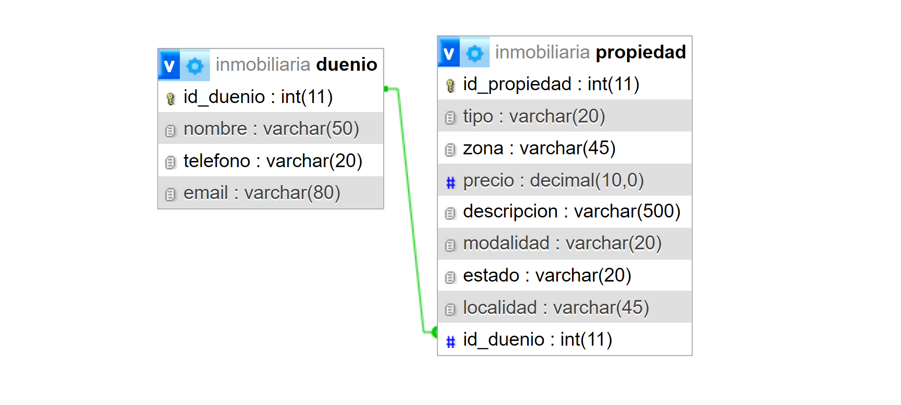
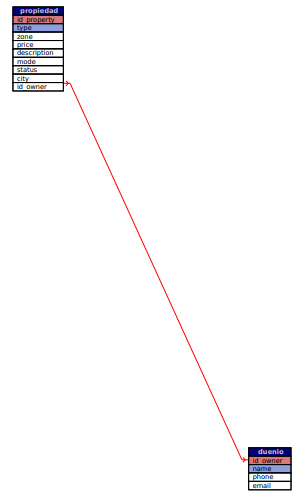

# Trabajo Práctico Especial - WEB 2 - TUDAI - UNICEN

Este proyecto consiste en el diseño y desarrollo de un sitio web para mostrar y administrar una base de datos relacional de una inmobiliaria. El objetivo es gestionar propiedades inmobiliarias y permitir la visualización de las mismas.

Para la segunda etapa del trabajo, se dió continuidad al desarrollo del sitio web dinámico basado en el modelo de datos propuesto en la primera entrega.

### Funcionalidades:
- Los **administradores** podrán **crear**, **actualizar**, **borrar** y **eliminar** propiedades.
- Los **usuarios** tendrán acceso únicamente a la **visualización** de las propiedades.

### Requerimientos Funcionales:

## Modelo de Datos

Las entidades principales de la base de datos son **propiedades** y **dueños**. Para cada una se construyó una tabla con sus respectivos atributos. 

- **Tabla propiedades**: Contiene información sobre las propiedades inmobiliarias.
- **Tabla dueños**: Almacena información sobre los dueños de las propiedades.

La relación entre estas tablas es de **1 a N**, lo que significa que un dueño puede tener múltiples propiedades, pero una propiedad solo puede pertenecer a un dueño.

### Atributos de la tabla `duenio`:
- `id_owner`: `int(11)` (Primary key)
- `name`: `varchar(50)`
- `phone`: `varchar(20)`
- `email`: `varchar(80)`

### Atributos de la tabla `propiedad`:
- `id_property`: `int(11)` (Primary key)
- `type`: `varchar(20)`
- `zone`: `varchar(45)`
- `price`: `decimal(10,0)`
- `description`: `varchar(500)`
- `mode`: `varchar(20)`
- `status`: `varchar(20)`
- `city`: `varchar(45)`
- `id_owner`: `int(11)` (Foreign key que referencia a la tabla `duenio`)

Estos atributos y relaciones permiten modelar la relación entre los dueños y sus propiedades en la base de datos.

## Diagrama de Datos

## Agradecimientos

Queremos agradecer a los docentes y ayudantes de la cátedra, así como a la universidad pública por su apoyo.

## Integrantes

- [Diego Santellán](https://www.linkedin.com/in/diego-santellan/)
- [Lis Medina](https://www.linkedin.com/in/lis-medina/)

## Importar la DB
Importar el archivo `inmobiliaria.sql` dentro de PHPMyAdmin para tener la base de datos completa.

# Usuario admin
username: `webadmin`
password: `admin`

ruta : http://localhost/inmobiliaria/ 
